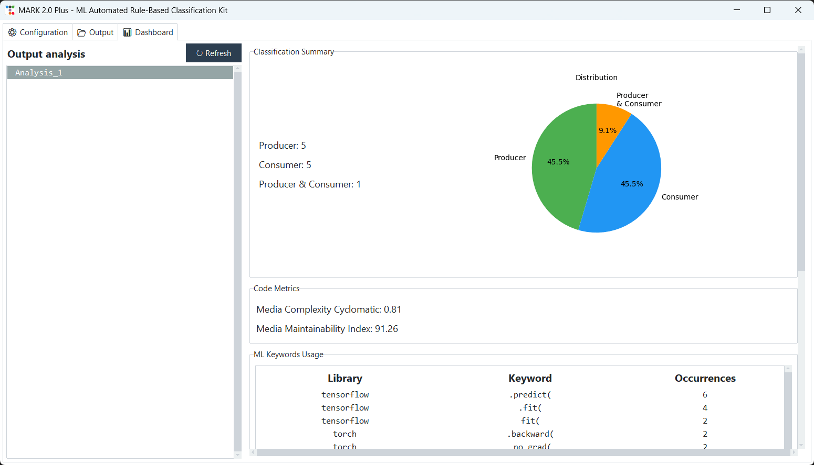
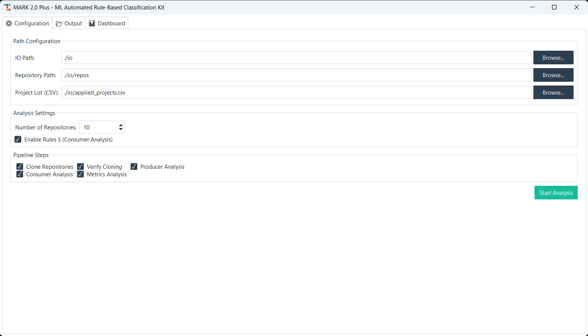
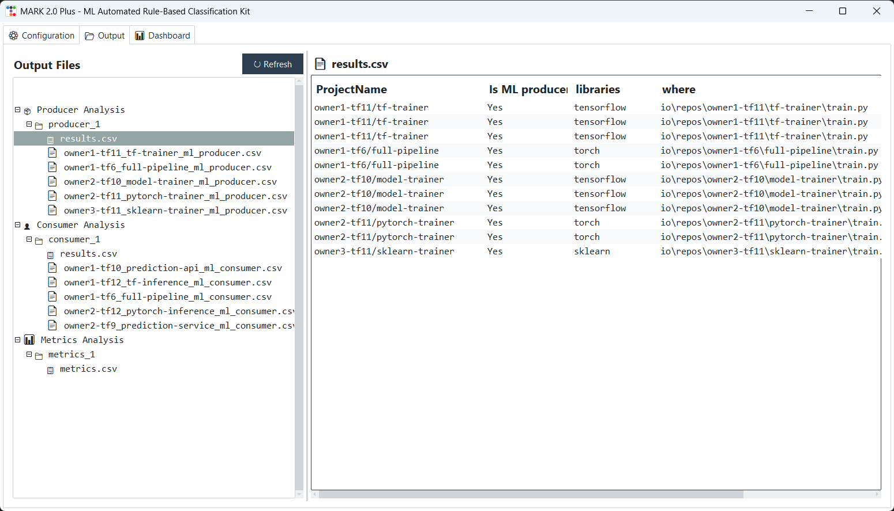
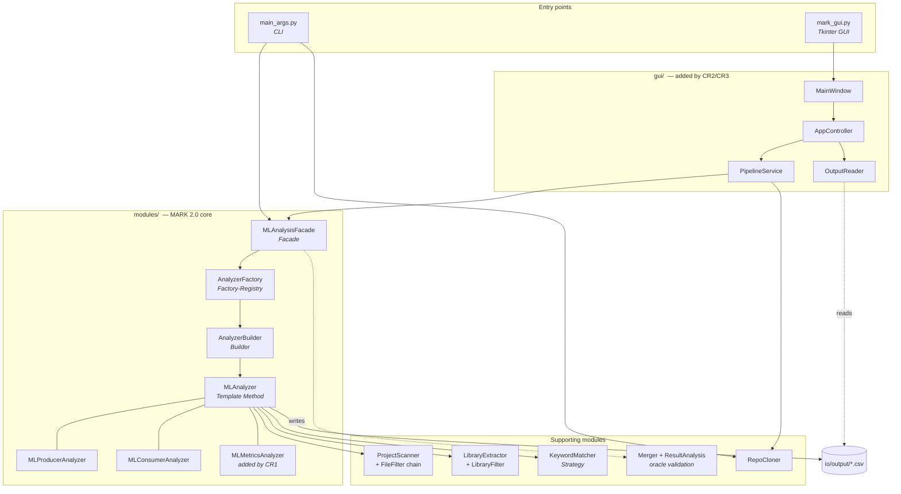

<h1 align="center">MARK 2.0 Plus</h1>

<p align="center">
  <strong>Static analysis that tells you whether an ML repository <em>trains</em> models or <em>uses</em> them</strong><br>
  <sub>Producer/Consumer classification for Python projects, extended with code-quality metrics, a desktop GUI and a reporting dashboard.</sub>
</p>

<p align="center">
  <a href="https://github.com/g-cer/mark-ml-classifier/actions/workflows/tests.yml"></a>
  
  
  
</p>

<p align="center">
  
</p>

---

## The problem

Research on **Software Engineering for AI-based systems (SE4AI)** constantly needs
reliable datasets of ML projects mined from GitHub. Building one by hand is slow and
**biased**: classification usually ends up resting on README prose and buzzwords, and two
projects that describe themselves identically often do very different things.

**MARK** attacks this with static analysis instead of prose. It reads the source, matches
imports against a curated knowledge base of ML libraries, looks for training versus
inference API calls, and applies explicit heuristic rules to label each project:

| Label | Meaning | Rule |
|---|---|---|
| **Producer** | The project builds or trains models | imports an ML library **and** calls a training API (`.fit(`, `.train(`, …) |
| **Consumer** | The project consumes pre-trained models | imports an ML library, calls an **inference** API, has **no** training API *(Rule 3)*, and the filename is not a test/example/eval file *(Rule 4)* |

Every decision is traceable to a file, a library and a line number — which is the point.
A learned classifier would be harder to audit, and this has to scale to thousands of
repositories.

## MARK 2.0 → MARK 2.0 Plus

This repository is the **evolution** of an existing tool, carried out as the exam project
for *Ingegneria del Software: Tecniche Avanzate* (MSc in Computer Science, University of
Salerno, Prof. Andrea De Lucia, 2025/2026).

The baseline, **MARK 2.0**, is the work of
[Mattia Preziuso](https://github.com/MattP-ita): an object-oriented refactoring of the
original MARK, with the classification logic split across `modules/` and built around
Facade, Factory-Registry, Builder and Strategy patterns. It shipped as a CLI script with
its configuration hard-coded in `main.py`.

**MARK 2.0 Plus** adds three Change Requests on top of that baseline, each classified per
**ISO/IEC/IEEE 14764:2022** as an *Enhancement*:

| | Change Request | Type | What it adds |
|---|---|---|---|
| **CR1** | Code-quality metrics | Additive + Perfective | Cyclomatic Complexity and Maintainability Index via [Radon](https://radon.readthedocs.io), computed per file and aggregated per project |
| **CR2** | Configuration GUI | Additive | A Tkinter interface to configure and run the pipeline without touching code |
| **CR3** | Reporting dashboard | Additive + Perfective | Embedded matplotlib charts summarising a run |

The interesting constraint: **CR2 and CR3 were built as separate layers that call the core
as a client, without modifying it.** The impact analysis on pre-existing components is
empty by construction, and the 16-test baseline suite confirmed it empirically.

<details>
<summary><strong>What changed, concretely</strong></summary>

Measured as `git diff` from the last baseline commit, excluding docs and tests:

| Area | Change |
|---|---|
| `gui/` | New — 10 files, ~1 240 lines (views, services, controller, main window) |
| `main_args.py` | New — CLI entry point with per-step flags, replacing hard-coded config |
| `mark_gui.py` | New — GUI entry point |
| `modules/analyzer/ml_metrics_analyzer.py` | New — `MLMetricsAnalyzer` |
| `modules/analyzer/builder/metrics_analyzer_builder.py` | New — registers the `METRICS` role |
| `modules/analyzer/ml_analyzer.py` | Extended — CC/MI/SLOC collection and per-project aggregation (+184 lines) |
| `modules/analyzer/ml_roles.py` | Extended — `METRICS` role |
| `test/` | New — 90 automated tests plus 12 Graphviz CFGs |

The rest of `modules/` is the baseline, essentially untouched.

</details>

## Quick start

```bash
git clone https://github.com/g-cer/mark-ml-classifier.git
cd mark-ml-classifier
pip install -r requirements.txt
```

**GUI** — the guided way:

```bash
python mark_gui.py
```

**CLI** — the scriptable way:

```bash
# Analyse repositories you already have on disk
python main_args.py --repository-path ./io/repos --analysis --metrics

# Clone from a CSV list, then analyse and validate against the oracle
python main_args.py --all --n-repos 20
```

Full flag reference: **[docs/cli-guide.md](docs/cli-guide.md)**.

**Tests**:

```bash
python -m pytest -q                                    # 90 tests
python -m pytest test/unit_testing test/integration_testing -q   # 46, no network
```

## The interface

<table>
<tr>
<td width="50%"></td>
<td width="50%"></td>
</tr>
<tr>
<td align="center"><sub><strong>Configuration</strong> — paths, step selection, Rule 3 toggle</sub></td>
<td align="center"><sub><strong>Output</strong> — browse the CSVs produced by each run</sub></td>
</tr>
</table>

The **Dashboard** tab (shown at the top) aggregates a run into three panels:
*Classification Summary* with a Producer/Consumer distribution chart, *Code Metrics* with
the average CC and MI, and *ML Keywords Usage* with the ten most frequently detected
library/keyword pairs.

> The screenshots come from a real run over the repositories in
> `test/system_testing/analysis_test/test_repos/` — the same fixtures the system tests use.

## Architecture



Design patterns actually in the code: **Facade** (`MLAnalysisFacade`), **Factory-Registry**
(`AnalyzerFactory` with a `@register(role)` decorator — adding the `METRICS` role required
no change to the factory at all), **Builder** (`AnalyzerBuilder` and its concrete
subclasses), **Strategy** (`KeywordExtractionStrategy`), **Template Method**
(`MLAnalyzer`), **Decorator** (`@log_and_time`), and an MVC-like split in `gui/`.

### Output layout

```
io/output/
├── producer/producer_<n>/
│   ├── results.csv                          # all evidence for the run
│   └── <owner>_<repo>_ml_producer.csv       # one file per classified project
├── consumer/consumer_<n>/
│   └── …
└── metrics/metrics_<n>/
    └── metrics.csv                          # ProjectName, CC_avg, MI_avg
```

`results.csv` carries one row per piece of evidence: project, library, file, keyword and
line number — so any classification can be traced back to the source that caused it.

## Engineering process

The evolution followed a controlled maintenance process, and the documents for each phase
are in [`docs/`](docs/):

```
Baseline system testing  →  Change Requests  →  Impact Analysis
        ↓                                              ↓
  16 regression tests                          implementation
        ↓                                              ↓
        └──────────→  Post-modification + regression testing
```

| Phase | Result |
|---|---|
| Pre-modification system testing | 16 black-box test cases (Category Partition) over 2 use cases — all passing, reused as the regression suite |
| Impact analysis (CR1) | \|SIS\| = 3 → \|CIS\| = 13 → \|AIS\| = 10, giving **Precision 0.77, Recall 1.00** |
| Impact analysis (CR2/CR3) | Empty by design — no core modification |
| Unit testing (white-box, CFG-driven) | 18 test cases, **97 % branch coverage** (66/68) |
| Integration testing (white-box) | 28 test cases, **90 % branch coverage** (86/96) |
| Post-modification system testing | 22 test cases across UC-CR1…UC-CR3 |
| Regression testing | 16/16 passing — no regressions |
| **Total** | **84 documented test cases, 0 failures** |

The three false positives in the CR1 impact analysis are the most interesting result: they
are all factory/builder methods that turned out **not** to need changing, which is direct
evidence that the baseline's Factory-Registry was extensible enough to absorb a new
analysis role for free.

> Running `pytest` collects **90** tests: the 84 documented cases plus 6 utility functions
> used by the GUI system tests, which are verified but are not test cases of the plan.

## Documentation

The whole process is written up as one document in Italian — the **[Software Evolution
Report](docs/pdf/mark-2.0-plus-report.pdf)** (42 pages), readable straight from GitHub:

| § | Section | What it answers |
|---|---|---|
| 1 | Introduzione | Why this work, and how the process is organised |
| 2 | Il sistema di partenza: MARK 2.0 | What does the system do today, how is it built, and what are its limits? |
| 3 | Verifica della baseline | How do we prove the baseline works, before touching it? |
| 4 | Le Change Request | What are we changing, and how does ISO 14764 classify it? |
| 5 | Master Test Plan | How will we verify the change? |
| 6 | Impact Analysis | What will the change touch, and how good was that prediction? |
| 7 | Testing post-modifica | Does the change work, and did anything regress? |
| 8 | Conclusioni | What did we end up with, and what did the process teach us? |

The source is a single self-contained file,
[`docs/latex/mark-2.0-plus-report.tex`](docs/latex/mark-2.0-plus-report.tex) — preamble,
macros and bibliography included, images aside. Build it with `cd docs/latex && make`, or
open the repo in Overleaf — see [docs/README.md](docs/README.md).

## Project layout

```
.
├── main.py  main_args.py  mark_gui.py   # entry points
├── modules/                             # MARK 2.0 core
│   ├── analyzer/                        #   classification + metrics
│   ├── cloner/                          #   GitHub acquisition
│   ├── keyword_extractor/               #   keyword/API extraction (Strategy)
│   ├── library_manager/                 #   ML library dictionaries
│   ├── scanner/                         #   file filtering
│   ├── oracle/                          #   ground-truth validation
│   └── utils/                           #   logging
├── gui/                                 # CR2/CR3 — views, services, controller
├── test/                                # 90 tests + 12 CFGs
├── tools/                               # grading script, CFG renderer
├── io/                                  # dictionaries, project list, run output
└── docs/                                # report, LaTeX source, coverage
```

## Credits

Developed by **[Giovanni Cerchia](https://github.com/g-cer)** and **Vincenzo Medica** for
*Ingegneria del Software: Tecniche Avanzate*, University of Salerno, 2025/2026.

Built on **MARK 2.0** by **[Mattia Preziuso](https://github.com/MattP-ita)**, itself an
object-oriented refactoring of the original MARK research tool.
